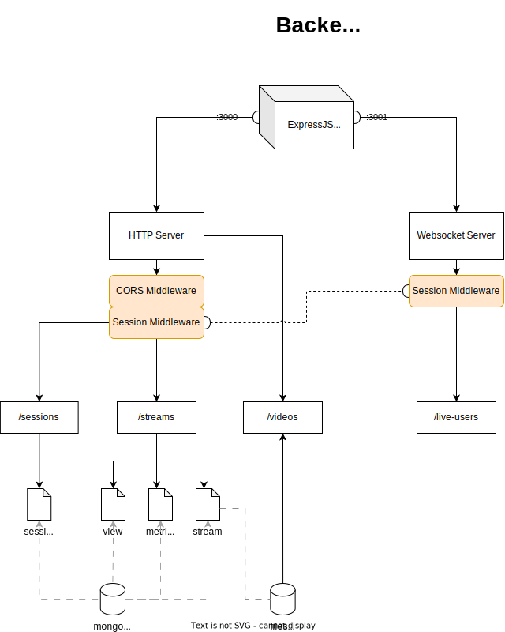

# CNS Server



[OpenAPI specs](docs/openapi.yaml)

This project was created using node (typescript), express and mongodb.

The following list of commands illustrates how the project was created.
Skip to the [next section](##run-the-server) if you want to run the project.

The project was generated using the following command
```bash
npx --yes --package express-generator express --force --view pug
```

CORS library was added to handle Cross Origin Resource Sharing.
```bash
npm install cors
```

Mongoose library was used to connect to mongodb.
```bash
npm install mongoose
```

NodeMon was added as dev dependencies to support running the server and client concurrently and to support hot reloading.
```bash
npm install --save-dev nodemon
```

Two scripts were added to package.json to support running the server and client concurrently and to support hot reloading.
```bash
"start": "nodemon index.js"
```

Express Session was added to support session management.
```bash
npm install express-session
```
The idea is that the session will be stored in the database and the session id will be stored in the cookie.
When the user accesses the frontend for the first time, the frontend will send a request to the backend to create a session.
The backend will create a session in the database and send the session id to the frontend in the form of a cookie.

Websocket and query-string libraries were added to support websocket.
```bash
npm install ws query-string
```

Install request-ip to get the ip address of the client
```bash
npm install request-ip
```

Install mongoose to connect to mongodb
```bash
npm install mongoose
```

## Database

Launch the database
```bash
# create a docker network
docker network create mongodb
# create the mongodb container attached to the network, with an exposed port and a mapped volume
docker run --name mongodb --network mongodb -d -p 27017:27017 -v mongodb-data:/data/db mongodb/mongodb-community-server
# create the mongo-express container attached to the network, with an exposed port
docker run --network mongodb -e ME_CONFIG_MONGODB_SERVER=mongodb -p 8081:8081 mongo-express
```

## Configuration

The `session.js` file contains some configuration for the session management.
Environment variables are used to configure the server. The `index.js` file contains the following code to load the environment variables.
```bash
# the port on which the http server will listen
HTTP_PORT=3000
# the port on which the websocket server will listen
WS_PORT=3001
# the port on which the rtmp server will listen
RTMP_PORT=1935
# the url of the mongodb database
DB_HOST=localhost
DB_PORT=27017
DB_NAME=cns
# the secret used to sign the session id
SESSION_SECRET=secret
# the name of the cookie used to store the session id
SESSION_NAME=cns.connect.sid
```
Default values will be used if the environment variables are not set.

## Initialize the database

The `schema/init.db.js` file contains the code to initialize the database.
The script can be started through the following command.
```bash
npm run init-db
```

## Run the server

Install the dependencies
```bash
npm install
```

Run the server
```bash
npm start
```
